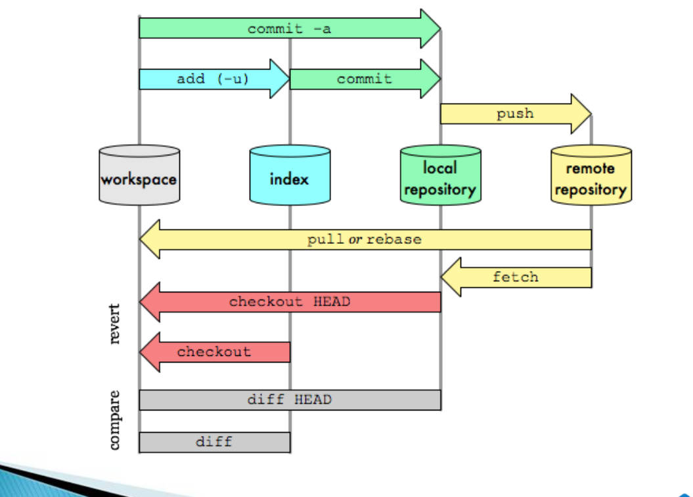
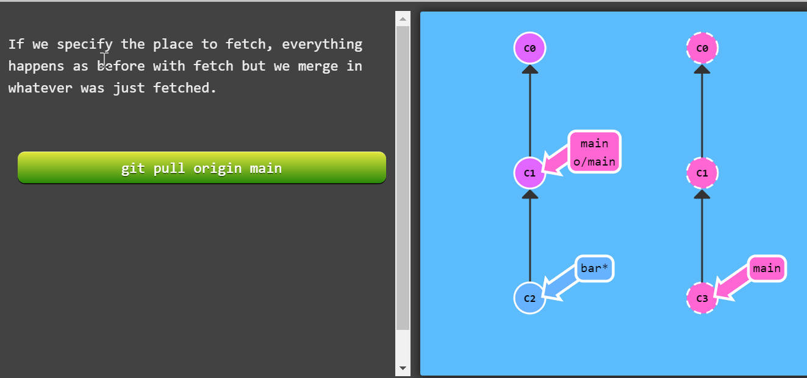
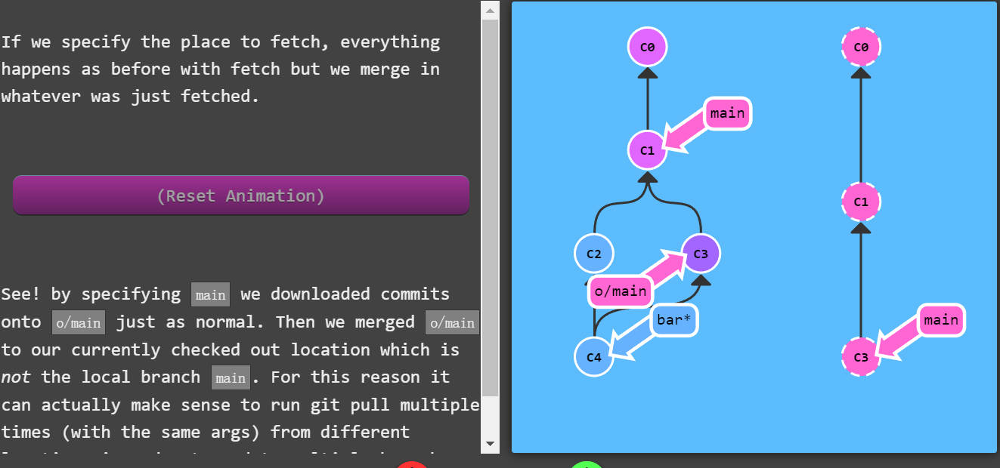

# Fatal Misunderstanding in my understanding of GIT PULL

# After GIT pull the new content from remote repository to the main branch*, main branch will include the new content and form a new commit.

